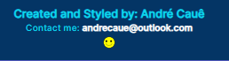
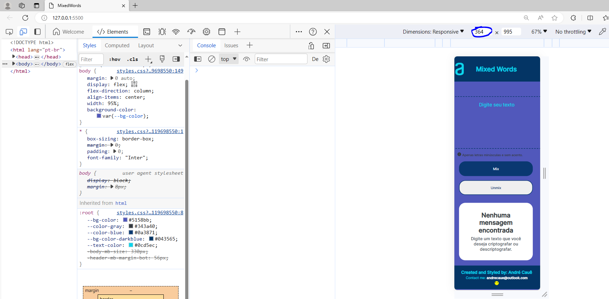
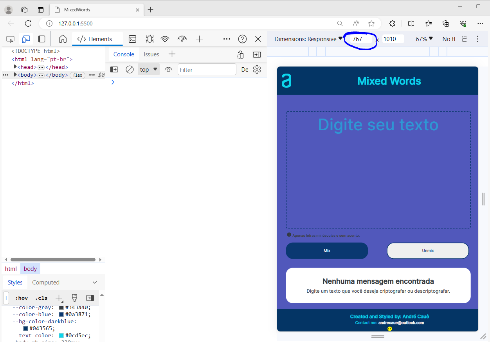
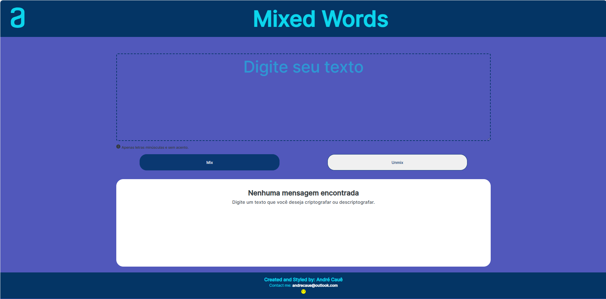

# 🚀 Alura Challenges Oracle ONE - MixedWords

  
  
  
  
  <

## 📋 Sobre o projeto
Este é um projeto-desafio do programa __ONE__ - __Oracle Next Education__.

Ele consiste em criptografar(mix) e descriptografar(unmix) textos inseridos, dando valores diferentes para as vogais.

## ⚙️ Tecnologias utilizadas
As tecnologias que foram utilizadas no projeto:

  

## 🔗 Link para teste
https://andre-g-c-araujo.github.io/changelling-mix/
